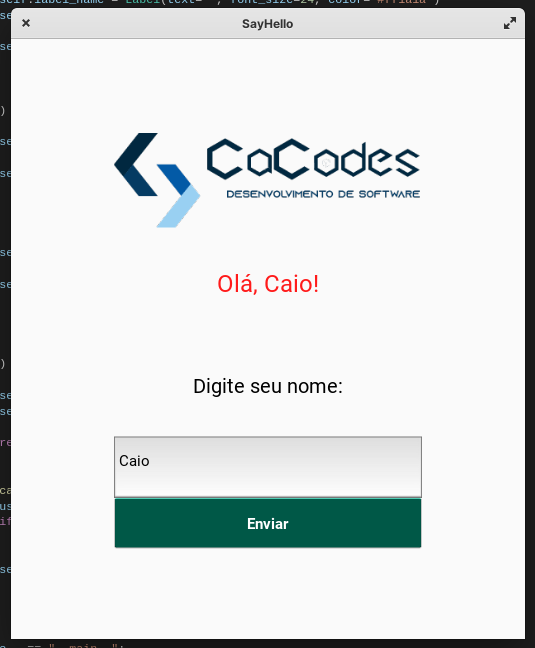

<p align="center" id="project-title">
    <a href="https://cacodes.com.br">
        
    </a>
    <h2 align="center">Simple Python Kivy Application that says Hello</h2>
</p>

<p align="center">
    
</p>


## 💻 Running the Project

This project was made with [`python3`](./https://www.python.org/), [`Kivy`](https://kivy.org/) and [`KivyMD`](https://kivymd.readthedocs.io/)

**Install dependecies:**
```
    pip install ./requirements.txt
```

**Run:**
```
    python main.py
```


## 📝 License

This project is under Apache 2.0 License. see the file [LICENSE](./LICENSE) for more details.

[⬆ Back to the top](#project-title)<br>